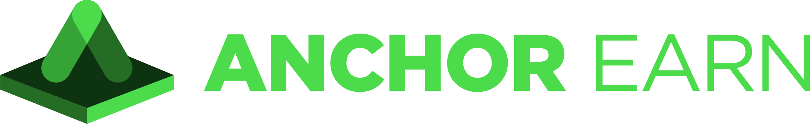

<p align="center"></p>

# Anchor Earn
Anchor Earn is a client SDK for building applications that can interact with the earn functionality of Anchor Protocol from within JavaScript runtimes. 
> **NOTE**
This SDK only supports the earn functionalities of anchor protocol and cannot be used for other functionalities like bond or borrow.
## Table of Contents <!-- omit in toc -->
- [Getting Started](#getting-started)
    - [Requirements](#requirements)
    - [Installation](#installation) 
    - [Dependencies](#dependencies)
    - [Test](#test)
- [Usage](#usage)
  - [Fund Account with UST](#fund-account-with-ust)
  - [Executor](#executor)
  - [Querier](#querier)
  - [CustomSigner](#customsigner)
  - [CustomBroadcaster](#custombroadcaster)
  - [Loggable](#loggable)
- [License](#license)
## Getting Started
A walk through of the steps to get started with the Anchor Earn SDK alongside with a few use case examples are provided below.
### Requirements
- Node.js 12+
- NPM
### Installation
Anchor Earn is available as a package on NPM and it is independent from other Terra and Anchor SDKs.\
To add to your JavaScript project's `package.json` as a dependency using preferred package manager: 
```bash
npm install -S @anchor-protocol/anchor-earn
```
or
```bash
yarn add @anchor-protocol/anchor-earn
```
### Dependencies
Anchor earn uses only Terra.js as a dependency. To get set up with the required dependencies, run:
```shell
# debug
yarn install
```
### Test
Anchor earn provides extensive tests for data classes and functions. To run them, after the steps in [Dependencies](#dependencies):
```shell
# debug
yarn test
```
## Usage
#### `Account` object
Anchor Earn provides a facility to create a wallet on the Terra blockchain.\
This functionality is accessible through the `Account` object.
```ts
const account = new Account();
```  
> **NOTE** It is crucial to store or write down your account information before doing any interactions with the SDK. A user can have access to this info by printing the account.
```ts
console.log(account.toData());
```
```
Account{
      acc_address: 'terra1awnxng53rlnzw3lcwwzsydrx2nj2fuas5nm3gm',
      public_key: 'terrapub1addwnpepqwke39mta5903ac05a42ug37hs5khrmsw7ffc7lzemy3vwzypjpzqju9f5d',
      private_key: <Buffer da 8e 5d b9 c4 df 74 57 9c ea d5 a7 c5 8b 50 80 7e 1c 1c e6 39 ce e2 60 10 9c cd bf 26 36 31 26>,
      mnemonic: 'cry pilot west bench pepper jeans joke slow gadget cloud chuckle wedding canal crop dolphin route ridge mouse canoe rural actor luxury guide buzz'
 }
```
`private_key` and `mnemonic` are essential for later usage. 

#### `Wallet` and `MnemonicKey` objects
The `Wallet` and `MnemonicKey` objects are borrowed from Terra.js, but users have access to them in Anchor Earn without any dependency on Terra.js.
In case users have a previous account on the Terra chain, they can use their private key and MnemonicKey to recover their keys.
 ```ts
import { Wallet, MnemonicKey } from '@anchor-protocol/anchor-earn';
    const account = new MnemonicKey({
      mnemonic:
        '...',
});
```
Another usage of the `wallet` object is being used inside the [customSigner](#customsigner). An example is provided in the [customSigner](#customsigner) section.

#### `AnchorEarn` object
Anchor Earn provides facilities for two main use cases: 
- execute: Signs the message and broadcasts it using Terra.js
- query: Runs a series of smart contract and chain queries through LCD
Both of these functions are accessible through the `AnchorEarn` object. 
To create the `AnchorEarn` object.
```ts
const anchorEarn = new AnchorEarn({
      chain: CHAINS.TERRA,
      network: NETWORKS.BOMBAY_12,
      privateKey: account.privateKey,
});
```
The above example uses the `Account` object for instantiating `anchor-earn`.
For the case that a user has a previous account on the Terra chain, the user can recover their key using `MnemonicKey` and use the following code to instantiate `AnchorEarn`.
 ```ts
import { MnemonicKey } from '@anchor-protocol/anchor-earn';
const account = new MnemonicKey({
      mnemonic:
        '...',
});

const anchorEarn = new AnchorEarn({
      chain: CHAINS.TERRA,
      network: NETWORKS.BOMBAY_12,
      privateKey: account.privateKey,
});
```
### Fund Account with UST
For Terra testnet (bombay-12), users can top up their balance with UST using [faucet](https://faucet.terra.money/).
### Executor
`AnchorEarn` helps execute three functionalities:
- deposit: deposit funds in the Anchor protocol
- withdraw: withdraw previously deposited funds
- send: transfer `UST` and `AUST` to other accounts
The following code snippets show how to use the `AnchorEarn` object.
> **NOTE**: Currently, Anchor Earn supports the deposit of the`UST` currency only.
#### Deposit 
To deposit funds in the Anchor Protocol, use the following example:
```ts
const deposit = await anchorEarn.deposit({
      amount: '...', // amount in natural decimal e.g. 100.5. The amount will be handled in macro.
      currency: DENOMS.UST,
    });
```
#### Withdraw
To withdraw funds from the protocol, use the following example:
```ts
const deposit = await anchorEarn.withdraw({
      amount: '...', // amount in natural decimal e.g. 100.5. The amount will be handled in macro.
      currency: DENOMS.UST,
});
```
#### Send
To send `UST` and `AUST` to other accounts, use the following example: 
<br/>
<sub>(For this functionality, the `AUST` denom is also supported.) </sub>
```ts
 const sendUst = await anchorEarn.send({
      currency: DENOMS.UST,
      recipient: 'terra1....',
      amount: '...', // amount in natural decimal e.g. 100.5. The amount will be handled in macro.
    });
```
### Querier
`AnchorEarn` querier facilitates both querying smart contracts and the chain. There are two queries provided by the `AnchorEarn` object:
- balance: query user balance and user deposit based on currency
- market: return the state of the specified currency's market
If a user wishes to use only the queries, there is no need to instantiate the object as explained [here](#anchorearn-object);
instead, they can provide the address for queries as demonstrated by the following examples: 
#### Balance
To get the current state of an account, use the following example:
> > **Note**: The address of the account must be specified in construction.
```ts
const anchorEarn = new AnchorEarn({
      chain: CHAINS.TERRA,
      network: NETWORKS.BOMBAY_12,
    });
const userBalance = await anchorEarn.balance({
      currencies: [DENOMS.UST],
});
```
#### Market
To get the current state of the market, use the example below:
```ts
const market = await anchorEarn.market({
      currencies: [DENOMS.UST],
});
```
### CustomSigner
Anchor Earn also provides users with the functionality to sign transactions and leave the signed transaction to the SDK to perform the broadcasting.
 
 `CustomSigner` is a callback function with which the users can sign `deposit`, `withdraw`, and `send` transactions.
  
The following code snippet specifies an example of the `CustomSigner` usage:
```ts
const customSigner = async (tx: Msg[]) => {
      const account = new MnemonicKey({
        mnemonic:
          '...',
      });

      const wallet = new Wallet(
        new LCDClient({
          URL: 'https://bombay-lcd.terra.dev',
          chainID: 'bombay-12',
        }),
        account,
      );

      return await wallet.createAndSignTx({
        msgs: tx,
        gasAdjustment: 2,
        gasPrices: { uusd: 0.15 },
      });
    };

    await anchorEarn.deposit({
      amount: '0.01',
      currency: DENOMS.UST,
      log: (data) => {
        console.log(data);
      },
      customSigner: customSigner,
});
```
### CustomBroadcaster
Anchor Earn facilitates a custom broadcast. This can be helpful in the case of applications that rely on external toolings to broadcast transactions. Here is an example of its usage:
```ts
const anchorEarn = new AnchorEarn({
      chain: CHAINS.TERRA,
      network: NETWORKS.BOMBAY_12,
      mnemonic:
        '...',
});
const customBroadcaster = async (tx: Msg[]) => {
          const lcd = new LCDClient({
            URL: 'https://bombay-lcd.terra.dev',
            chainID: 'bombay-12',
          });

          const wallet = new Wallet(
              lcd,
              new MnemonicKey({
                mnemonic:
                    '...',
              }),
          );

          const signedTx = await wallet.createAndSignTx({
            msgs: tx,
            gasAdjustment: 2,
            gasPrices: { uusd: 0.15 },
          });

          return lcd.tx.broadcastSync(signedTx).then((result) => {
            return result.txhash;
          });
};
await anchorEarn.withdraw({
      amount: '0.01',
      currency: DENOMS.AUST,
      log: (data) => {
        console.log(data);
      },
      customBroadcaster: customBroadcaster
});
``` 

### Loggable 
For seeing the progress of the transaction on the chain, `loggable` is provided. The following code shows how to use it:
```ts
const deposit = await anchorEarn.deposit({
      amount: '...',
      currency: DENOMS.UST,
      log: (data) => {
        console.log(data);
      }
    });
```
## License
This software is licensed under the Apache 2.0 license. Read more about it [here](./LICENSE).
© 2021 Anchor Protocol